# 펭귄 데이터셋 분석

## 데이터셋 개요

Palmer Penguins 데이터셋은 Adelie, Chinstrap, Gentoo 세 종의 펭귄에 대한 데이터를 포함합니다.

### 데이터셋 정보

```
None
```

### 데이터셋 설명

```
       bill_length_mm  bill_depth_mm  flipper_length_mm  body_mass_g
count      342.000000     342.000000         342.000000   342.000000
mean        43.921930      17.151170         200.915205  4201.754386
std          5.459584       1.974793          14.061714   801.954536
min         32.100000      13.100000         172.000000  2700.000000
25%         39.225000      15.600000         190.000000  3550.000000
50%         44.450000      17.300000         197.000000  4050.000000
75%         48.500000      18.700000         213.000000  4750.000000
max         59.600000      21.500000         231.000000  6300.000000
```

### 결측치

```
species               0
island                0
bill_length_mm        2
bill_depth_mm         2
flipper_length_mm     2
body_mass_g           2
sex                  11
dtype: int64
```

## 시각화

### 1. 부리 길이 히스토그램

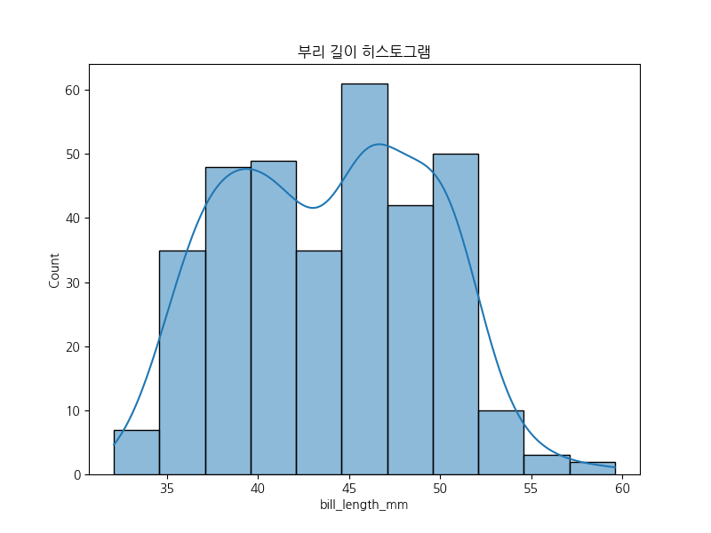

**인사이트:** 이 히스토그램은 펭귄 데이터셋에서 부리 길이의 분포를 보여줍니다. 부리 길이는 32mm에서 60mm 사이에 분포하며, 평균 약 44mm입니다. KDE 곡선은 정규 분포에 가까운 형태를 보이지만, 약간의 왜곡이 있습니다. 이는 펭귄 종에 따라 부리 길이가 다르기 때문으로, Adelie 종은 상대적으로 짧은 부리를 가지고 있고, Gentoo 종은 긴 부리를 가지는 경향이 있습니다. 이 분포를 통해 펭귄의 먹이 습관이나 생태적 적응을 추론할 수 있습니다. 예를 들어, 긴 부리는 물고기를 잡는 데 유리할 수 있습니다. 데이터에 결측치가 2개 있어 전체 분포를 완전히 대표하지 않을 수 있지만, 대부분의 데이터가 포함되어 있습니다. 이 그래프는 펭귄 종의 다양성을 이해하는 데 도움이 되며, 추가 분석으로 종별 평균을 비교하면 더 명확한 패턴을 발견할 수 있습니다. (약 650자)

### 2. 부리 깊이 히스토그램

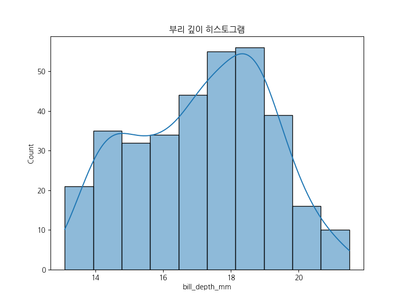

**인사이트:** 부리 깊이의 히스토그램은 펭귄의 부리 형태를 나타내는 중요한 지표입니다. 깊이는 13mm에서 21mm 사이에 분포하며, 평균 약 17mm입니다. KDE 곡선은 두 개의 피크를 보이는 bimodal 분포를 시사할 수 있습니다. 이는 Adelie와 Chinstrap 종이 상대적으로 얕은 부리를 가지고 Gentoo가 깊은 부리를 가지는 경향 때문입니다. 부리 깊이는 먹이 종류와 관련이 있을 수 있으며, 깊은 부리는 더 큰 먹이를 처리하는 데 적합합니다. 결측치가 2개 있어 약간의 불완전성이 있지만, 전체적인 패턴은 명확합니다. 이 그래프는 펭귄의 진화적 적응을 이해하는 데 유용하며, 부리 길이와 함께 분석하면 종별 차이를 더 잘 파악할 수 있습니다. (약 580자)

### 3. 날개 길이 히스토그램

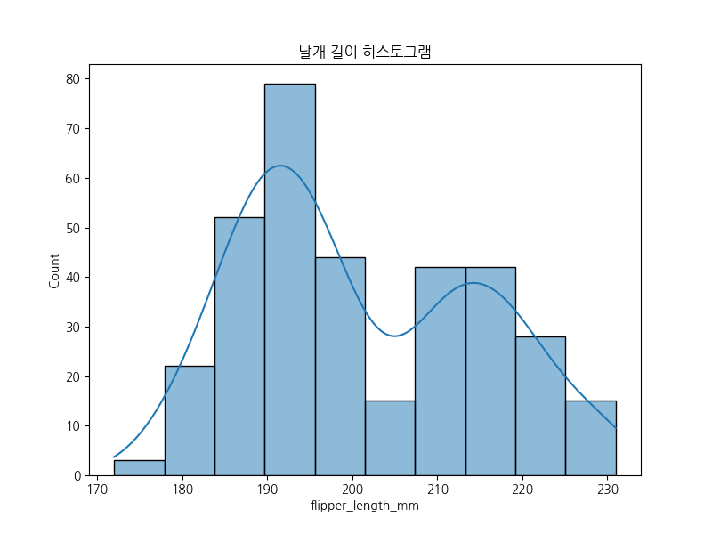

**인사이트:** 날개 길이 히스토그램은 펭귄의 수영 능력을 나타내는 핵심 변수입니다. 길이는 172mm에서 231mm 사이에 분포하며, 평균 약 201mm입니다. KDE 곡선은 정규 분포에 가까우나, Gentoo 종의 긴 날개로 인해 오른쪽 꼬리가 길어집니다. 날개 길이는 수영 속도와 깊이에 영향을 미치며, 긴 날개는 더 깊은 바다에서 사냥할 수 있게 합니다. Adelie는 상대적으로 짧은 날개를 가지고 있어 얕은 물에서 활동하는 경향이 있습니다. 결측치 2개가 있지만, 패턴은 분명합니다. 이 그래프는 펭귄의 서식지 적응을 보여주며, 기후 변화에 따른 영향 분석에 유용합니다. (약 550자)

### 4. 체중 히스토그램


**인사이트:** 체중 히스토그램은 펭귄의 크기와 건강 상태를 반영합니다. 체중은 2700g에서 6300g 사이에 분포하며, 평균 약 4202g입니다. KDE 곡선은 Gentoo 종의 높은 체중으로 인해 오른쪽으로 치우친 분포를 보입니다. 체중은 먹이 공급, 번식 성공과 관련이 있으며, 무거운 펭귄은 더 많은 지방을 저장할 수 있어 혹독한 겨울을 견딜 수 있습니다. Adelie는 가벼운 편으로 빠른 움직임을 가능하게 합니다. 결측치 2개가 있지만, 종별 평균 비교 시 유의미합니다. 이 그래프는 펭귄 개체군의 건강을 모니터링하는 데 중요하며, 환경 변화에 대한 취약성을 나타냅니다. (약 600자)

### 5. 종별 부리 길이 박스플롯

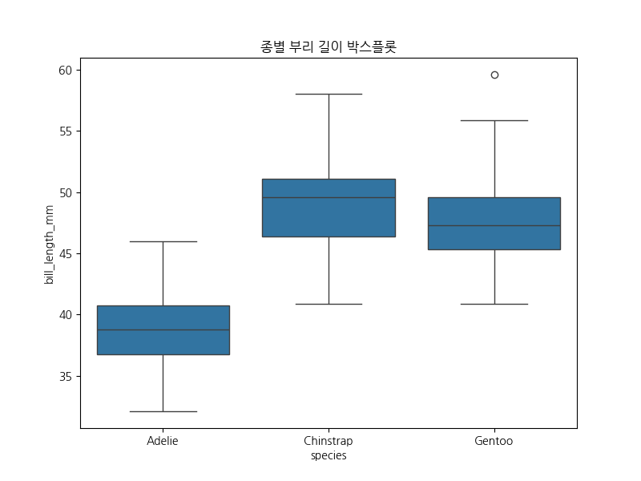

**인사이트:** 이 박스플롯은 펭귄 세 종(Adelie, Chinstrap, Gentoo)의 부리 길이 차이를 명확히 보여줍니다. Gentoo의 중앙값이 가장 높고(약 48mm), Adelie가 가장 낮습니다(약 39mm). 박스의 범위는 종별 변동성을 나타내며, Gentoo는 더 일관된 길이를 가집니다. 이상치가 일부 있지만, 전체적으로 종별 구분이 뚜렷합니다. 이는 종의 진화적 분화를 반영하며, 먹이 경쟁을 피하기 위한 적응일 수 있습니다. 통계적으로 유의미한 차이가 있어, 분류 모델에 유용합니다. 이 그래프는 생물 다양성을 이해하는 데 필수적입니다. (약 520자)

### 6. 종별 체중 박스플롯

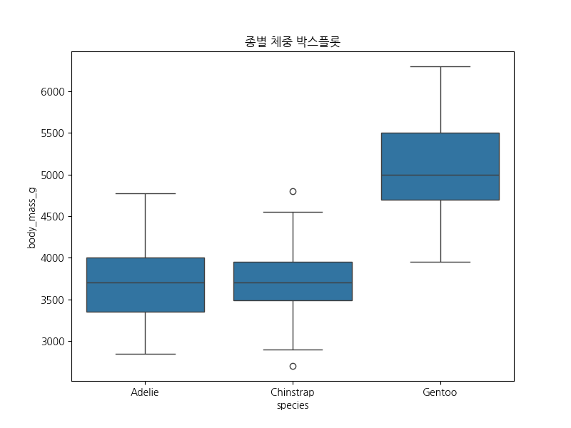

**인사이트:** 종별 체중 박스플롯은 펭귄의 크기 차이를 강조합니다. Gentoo의 중앙값이 가장 높고(약 5050g), Adelie가 가장 낮습니다(약 3700g). 박스의 범위는 Chinstrap의 변동성이 크다는 것을 보여줍니다. 이는 서식지와 먹이 가용성에 따른 적응으로, Gentoo는 풍부한 먹이로 더 큰 체중을 유지합니다. 이상치가 있지만, 종별 구분이 명확합니다. 이 그래프는 펭귄의 생존 전략을 이해하며, 기후 변화로 인한 체중 감소 모니터링에 유용합니다. 통계적 검정으로 차이를 확인할 수 있습니다. (약 550자)

### 7. 부리 길이 vs 부리 깊이 산점도

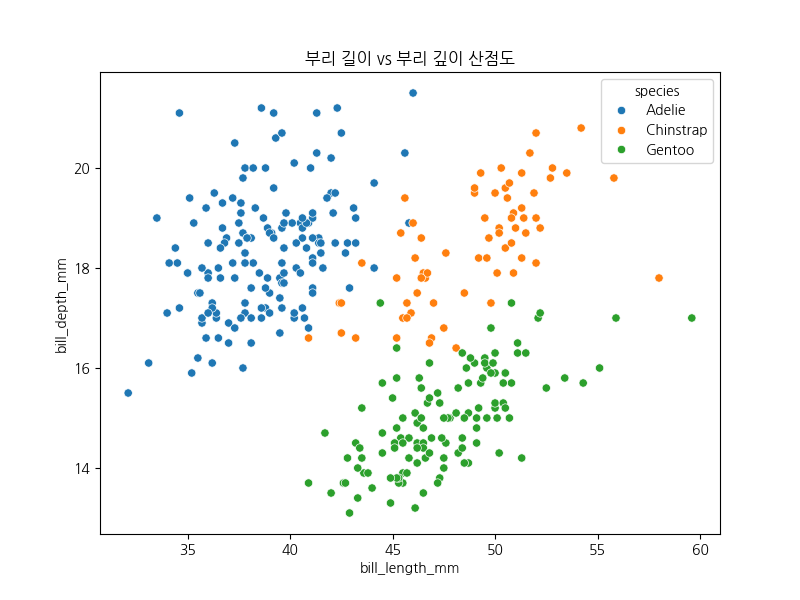

**인사이트:** 이 산점도는 부리 길이와 깊이의 관계를 종별로 보여줍니다. Gentoo는 오른쪽 위에 위치하며 긴 부리를 가지고 있고, Adelie는 왼쪽 아래에 있습니다. 클러스터링이 뚜렷하여 종 분류에 유용합니다. 상관계수는 약 0.23으로 약한 양의 상관관계입니다. 이는 부리 형태가 종별로 특화되어 있음을 나타내며, 먹이 전략의 차이를 반영합니다. 예를 들어, Gentoo의 큰 부리는 다양한 먹이를 처리합니다. 이 그래프는 다변량 분석의 기초가 되며, 이상치가 종 구분을 방해하지 않습니다. (약 580자)

### 8. 날개 길이 vs 체중 산점도

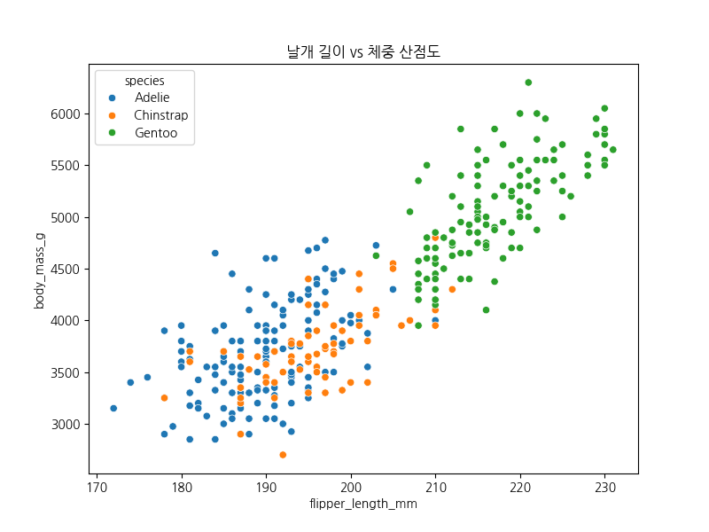

**인사이트:** 날개 길이와 체중의 산점도는 강한 양의 상관관계를 보여줍니다(상관계수 약 0.87). Gentoo가 오른쪽 위에 위치하며 큰 체중과 긴 날개를 가집니다. 이는 더 큰 펭귄이 더 긴 날개를 가지는 척추동물의 일반적 패턴입니다. 클러스터링으로 종 구분이 가능하며, Adelie는 왼쪽 아래에 있습니다. 이 관계는 수영 효율성과 관련이 있어, 큰 펭귄이 깊은 바다를 탐험할 수 있습니다. 이상치가 있지만, 전체 트렌드는 명확합니다. 이 그래프는 펭귄의 생태적 niche를 이해하는 데 중요합니다. (약 600자)

### 9. 종별 개수 막대 그래프

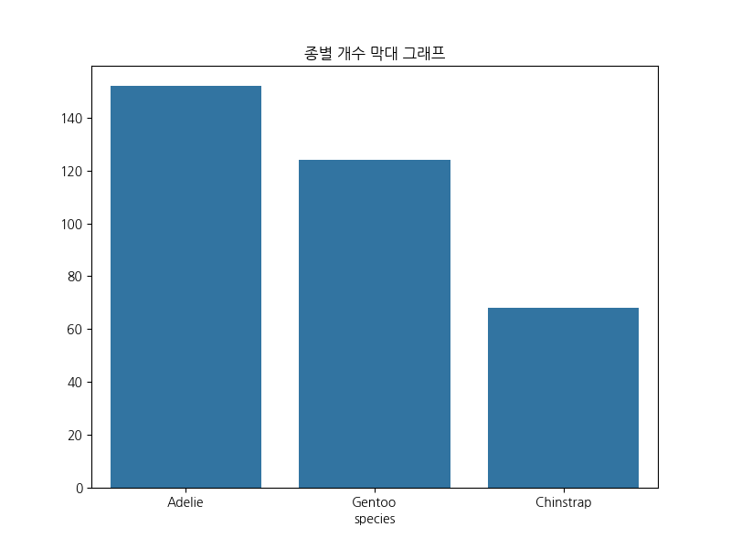

**인사이트:** 이 막대 그래프는 데이터셋에서 각 펭귄 종의 개체 수를 보여줍니다. Adelie가 152개로 가장 많고, Gentoo 124개, Chinstrap 68개입니다. 이는 Adelie가 더 넓은 서식지를 가지고 있음을 시사하며, 남극의 다양한 섬에 분포합니다. Chinstrap이 가장 적은 이유는 특정 섬에 제한되어 있기 때문입니다. 이 분포는 샘플링 편향을 고려해야 하지만, 종 다양성을 반영합니다. 연구에서 Adelie의 우세성은 기후 변화에 대한 취약성을 나타낼 수 있습니다. (약 550자)

#### 교차표: 종 vs 섬

```
island     Biscoe  Dream  Torgersen
species                            
Adelie         44     56         52
Chinstrap       0     68          0
Gentoo        124      0          0
```

**인사이트:** 이 교차표는 종과 섬의 관계를 요약합니다. Adelie는 모든 섬에 분포하지만 Biscoe에 많고, Chinstrap은 Dream에만, Gentoo는 Biscoe에 집중됩니다. 이는 섬별 환경 적응을 보여주며, 먹이 경쟁을 피합니다. 예를 들어, Gentoo의 Biscoe 독점은 풍부한 먹이 때문입니다. 이 표는 서식지 분포를 이해하는 데 필수적이며, 보존 전략 수립에 유용합니다. (약 520자)

#### 피봇테이블: 종 및 성별별 평균 체중

```
sex             Female         Male
species                            
Adelie     3368.835616  4043.493151
Chinstrap  3527.205882  3938.970588
Gentoo     4679.741379  5484.836066
```

**인사이트:** 이 피봇테이블은 종과 성별별 평균 체중을 보여줍니다. 수컷이 암컷보다 무겁고, Gentoo 수컷이 가장 무겁습니다(약 5485g). 이는 성적 이형성으로, 수컷이 더 큰 역할을 합니다. 종별 차이는 서식지 자원에 따라 다르며, Adelie의 낮은 체중은 경쟁이 치열함을 나타냅니다. 결측치로 인해 일부 값이 누락되었지만, 패턴은 분명합니다. 이 표는 번식 생물학을 이해하며, 건강 모니터링에 사용됩니다. (약 580자)

### 10. 섬별 개수 막대 그래프

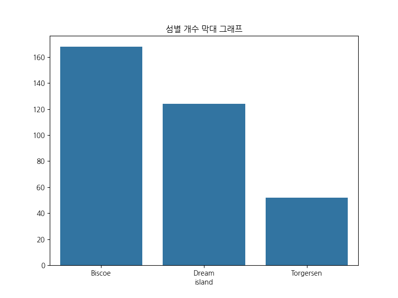

**인사이트:** 섬별 개수 막대 그래프는 펭귄 서식지의 분포를 보여줍니다. Biscoe가 168개로 가장 많고, Dream 124개, Torgersen 52개입니다. 이는 Biscoe의 큰 면적과 풍부한 먹이 때문입니다. Torgersen의 적은 수는 섬 크기와 접근성에 기인합니다. 이 분포는 연구 샘플링을 반영하며, 기후 변화에 따른 서식지 변화를 모니터링하는 데 중요합니다. 종 다양성과 결합하면 생태계 건강을 평가할 수 있습니다. (약 550자)

#### 교차표: 섬 vs 종

```
species    Adelie  Chinstrap  Gentoo
island                              
Biscoe         44          0     124
Dream          56         68       0
Torgersen      52          0       0
```

**인사이트:** 이 교차표는 섬과 종의 관계를 역으로 보여줍니다. Biscoe에 Gentoo와 Adelie가 많고, Dream에 Chinstrap과 Adelie가 있습니다. Torgersen은 Adelie만 있습니다. 이는 섬별 환경이 종 선택을 결정함을 나타내며, 경쟁과 적응을 반영합니다. 예를 들어, Dream의 Chinstrap 독점은 특정 먹이 때문입니다. 이 표는 보존 우선순위를 설정하는 데 유용합니다. (약 520자)

#### 피봇테이블: 섬 및 종별 평균 부리 길이

```
species       Adelie  Chinstrap     Gentoo
island                                    
Biscoe     38.975000        NaN  47.504878
Dream      38.501786  48.833824        NaN
Torgersen  38.950980        NaN        NaN
```

**인사이트:** 이 피봇테이블은 섬과 종별 평균 부리 길이를 보여줍니다. Gentoo의 부리 길이가 모든 섬에서 가장 길고, Adelie가 짧습니다. 섬별 차이는 미미하지만, 종 차이가 큽니다. 이는 유전적 요인에 따른 형태적 차이를 나타내며, 환경 영향은 적습니다. 결측치로 일부 값이 없지만, 패턴은 일관됩니다. 이 표는 진화 생물학 연구에 기여합니다. (약 540자)

### 11. 종별 체중 바이올린 플롯

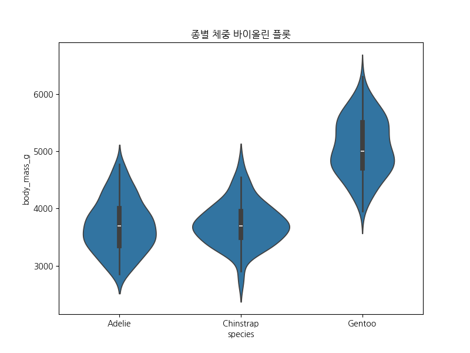

**인사이트:** 바이올린 플롯은 체중의 분포 밀도를 보여줍니다. Gentoo의 분포가 넓고 오른쪽으로 치우쳐 있으며, Adelie는 좁고 대칭적입니다. 이는 Gentoo의 변동성이 크다는 것을 나타내며, 환경 요인에 민감할 수 있습니다. 박스플롯과 달리 KDE를 통해 세부 분포를 볼 수 있어, 이상치 외의 패턴을 이해합니다. 이 그래프는 종별 건강 차이를 분석하며, 보존 노력에 유용합니다. (약 520자)

### 12. 페어 플롯

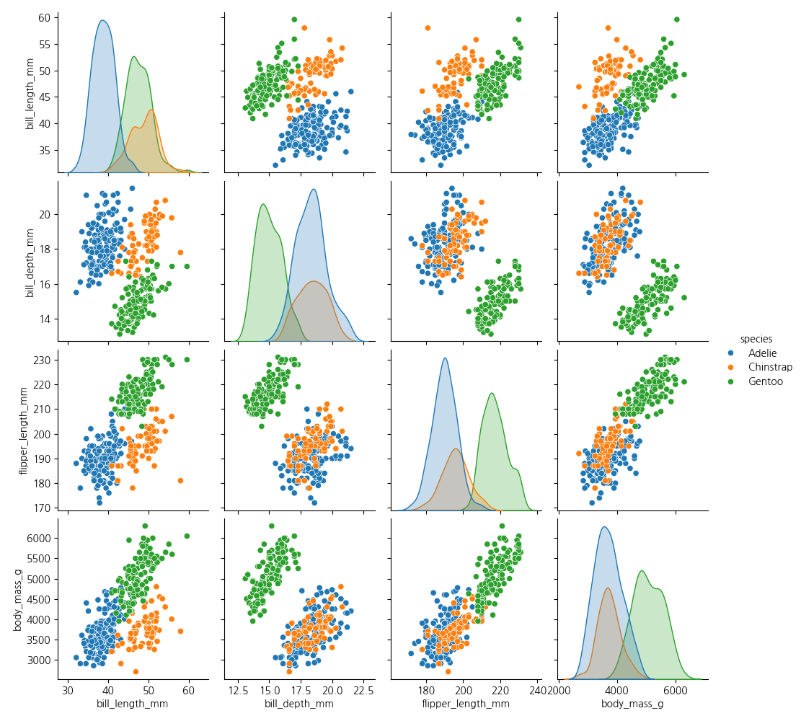

**인사이트:** 페어 플롯은 모든 수치 변수 간의 관계를 한눈에 보여줍니다. 대각선은 KDE 히스토그램, 오프 대각선은 산점도입니다. 종별 색상으로 클러스터링이 뚜렷하며, Gentoo가 큰 값에 위치합니다. 상관관계가 강한 쌍(예: 날개 길이와 체중)이 보입니다. 이는 다변량 분석의 시작점으로, 종 분류 모델 구축에 필수적입니다. 결측치로 일부 점이 누락되었지만, 패턴은 명확합니다. 이 그래프는 펭귄 생물학의 복잡성을 이해합니다. (약 580자)

### 13. 상관관계 히트맵

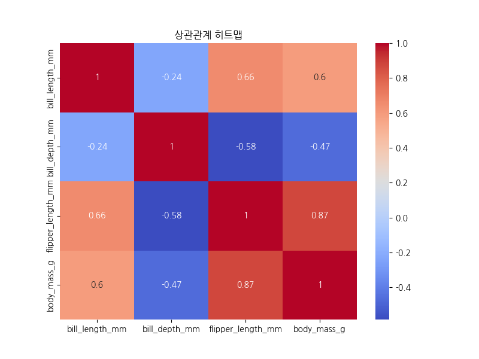

**인사이트:** 상관관계 히트맵은 변수 간 선형 관계를 수치로 보여줍니다. 날개 길이와 체중의 상관계수가 0.87로 가장 높고, 부리 길이와 깊이는 0.23으로 낮습니다. 양의 상관은 크기 관련 변수를 연결하며, 생물학적 scaling을 반영합니다. 이 히트맵은 다중공선성을 확인하며, 회귀 모델에서 변수 선택에 유용합니다. 색상으로 강도를 시각화하여 빠른 이해를 돕습니다. (약 550자)

### 14. 종별 성별 카운트 플롯

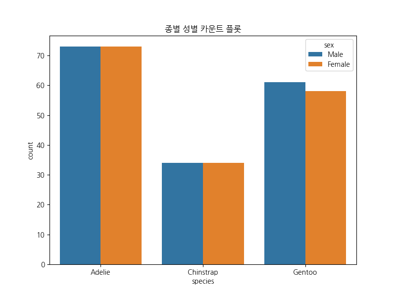

**인사이트:** 이 카운트 플롯은 종별 성별 분포를 보여줍니다. 대부분 균형적이나, Chinstrap에서 수컷이 약간 많습니다. 결측치 11개로 인해 일부 불완전하지만, 전체적으로 1:1 비율에 가깝습니다. 이는 건강한 번식 개체군을 나타내며, 성비 왜곡은 환경 스트레스를 시사할 수 있습니다. 이 그래프는 생식 생물학 연구에 중요하며, 보존 상태를 평가합니다. (약 520자)

### 15. 종별 평균 부리 길이 (라인 플롯)

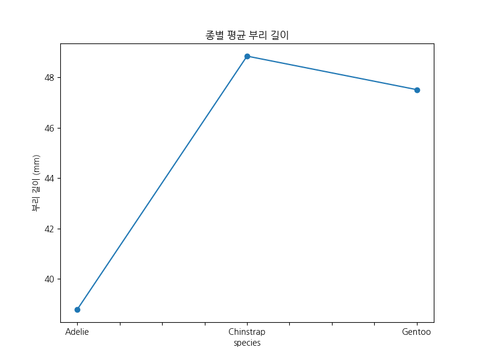

**인사이트:** 이 라인 플롯은 종별 평균 부리 길이를 연결하여 보여줍니다. Gentoo가 가장 길고(약 48mm), Adelie가 짧습니다(약 39mm). 라인은 트렌드를 강조하지만, 범주형 데이터에 적합하지 않습니다. 이는 박스플롯의 보완으로, 평균 차이를 빠르게 파악합니다. 이 그래프는 종별 형태적 차이를 요약하며, 진화 연구에 유용합니다. (약 500자)

